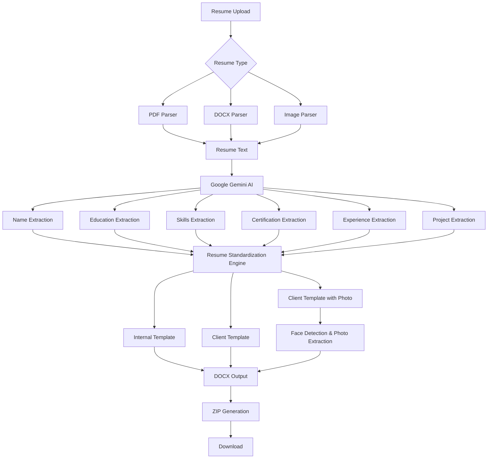

# 📄 Resume Standardization System – AI-Powered Resume Transformation

An intelligent resume standardization platform built with **Streamlit**, **Google Gemini AI**, **Python-Docx**, and **Computer Vision** that automatically converts resumes from multiple formats into predefined corporate templates.

The system extracts, analyzes, restructures, and formats resumes into standardized organizational templates while preserving essential candidate information.

**Source:** Based on the uploaded implementation files.  

---

# 🚀 Features

### 📂 Multi-Format Resume Upload

Supports:

* PDF resumes
* DOCX resumes
* JPG/JPEG resumes
* PNG resumes

### 🤖 AI-Powered Information Extraction

Uses **Google Gemini** to extract:

* Candidate Name
* Professional Summary
* Education Details
* Certifications
* Technical Skills
* Work Experience
* Project Experience
* Organization Information

### 📝 Resume Standardization

Converts resumes into:

1. Internal Corporate Template
2. Client Template
3. Client Template with Passport Photo

### 🖼 Image Resume Processing

For image-based resumes:

* OCR through Gemini Vision
* Resume text extraction
* Information parsing

### 🎓 Education Parsing

Automatically extracts:

* Degree
* Institution
* Year of Passing

### 💼 Project Experience Generation

AI generates:

* Project Title
* Role
* Duration
* Technologies Used
* Responsibilities

### 📷 Passport Photo Extraction

Using OpenCV:

* Detects face from resume
* Crops passport-sized photo
* Inserts photo into client template

### 📦 Bulk Processing

* Upload multiple resumes
* Process simultaneously
* Download ZIP package

### 🔐 API Access Modes

* User Gemini API Key
* Trial Mode (Limited Use)

---

# 🏗 System Architecture

```text
                        ┌──────────────────────┐
                        │      User Uploads    │
                        │ PDF / DOCX / Images  │
                        └──────────┬───────────┘
                                   │
                                   ▼
                    ┌───────────────────────────┐
                    │   Resume Input Processor  │
                    └──────────┬────────────────┘
                               │
             ┌─────────────────┼─────────────────┐
             │                 │                 │
             ▼                 ▼                 ▼

      PDF Parser        DOCX Parser      Image Parser
    (PyMuPDF)        (python-docx)     (Gemini Vision)

             └─────────────────┬─────────────────┘
                               ▼

                  ┌────────────────────────┐
                  │ Resume Text Extraction │
                  └──────────┬─────────────┘
                             ▼

                 ┌─────────────────────────┐
                 │   Google Gemini AI      │
                 │ Information Extraction  │
                 └──────────┬──────────────┘
                            │
                            ▼

     ┌──────────────────────────────────────────────┐
     │ Extracted Resume Components                  │
     │----------------------------------------------│
     │ • Name                                       │
     │ • Summary                                    │
     │ • Skills                                     │
     │ • Education                                  │
     │ • Certifications                             │
     │ • Work Experience                            │
     │ • Projects                                   │
     └───────────────────┬──────────────────────────┘
                         ▼

         ┌──────────────────────────────────┐
         │ Resume Standardization Engine     │
         └──────────────┬───────────────────┘
                        │
      ┌─────────────────┼───────────────────┐
      │                 │                   │
      ▼                 ▼                   ▼

 Internal       Client Template     Client Template
 Template                           + Photo Template

      │                 │                   │
      └─────────────────┼───────────────────┘
                        ▼

          ┌────────────────────────────┐
          │ DOCX Generation Engine     │
          │ (python-docx Templates)    │
          └─────────────┬──────────────┘
                        ▼

             ┌──────────────────────┐
             │ ZIP Package Creation │
             └──────────┬───────────┘
                        ▼

                 Download Results
```

---

# 🔄 Workflow Architecture

```text
Resume Upload
      │
      ▼
Format Detection
      │
      ▼
Text Extraction
      │
      ▼
Gemini AI Analysis
      │
      ▼
Information Categorization
      │
      ├── Name
      ├── Education
      ├── Skills
      ├── Certifications
      ├── Experience
      └── Projects
      │
      ▼
Template Population
      │
      ▼
Document Cleaning
      │
      ▼
Formatting & Validation
      │
      ▼
ZIP Export
```

---

# 🛠 Tech Stack

| Component              | Technology              |
| ---------------------- | ----------------------- |
| Frontend               | Streamlit               |
| LLM                    | Google Gemini 2.5 Flash |
| Vision Model           | Gemini Vision           |
| PDF Parsing            | PyMuPDF                 |
| DOCX Processing        | python-docx             |
| Image Processing       | OpenCV                  |
| Face Detection         | Haar Cascade            |
| PDF Generation         | ReportLab               |
| Packaging              | ZipFile                 |
| Environment Management | dotenv                  |

---

# 📁 Project Structure

```text
Resume-Standardization-System/
│
├── app.py
├── all_functions.py
├── .env
│
├── Templates/
│   ├── Kasukabe_template.docx
│   ├── Client sample format.docx
│   └── Client sample format-2.docx
│
├── agilisium_resume_internal_template/
├── agilisium_resume_client_format/
├── agilisium_resume_client_format_2/
│
├── passport_photo.png
│
└── README.md
```

---

# ⚙️ Installation

### Clone Repository

```bash
git clone https://github.com/yourusername/resume-standardization-system.git

cd resume-standardization-system
```

### Create Virtual Environment

```bash
python -m venv venv

source venv/bin/activate
```

Windows:

```bash
venv\Scripts\activate
```

### Install Dependencies

```bash
pip install -r requirements.txt
```

### Configure Environment

Create `.env`

```env
GEMINI_API_KEY=YOUR_API_KEY
```

### Run Application

```bash
streamlit run app.py
```

---

# 📊 AI Processing Pipeline

```text
Resume
   │
   ▼
Text Extraction
   │
   ▼
Gemini AI
   │
   ├── Name Extraction
   ├── Education Analysis
   ├── Skill Extraction
   ├── Certification Analysis
   ├── Experience Summarization
   └── Project Understanding
   │
   ▼
Structured Resume Data
   │
   ▼
Template Generation
```

---

# 🎯 Business Use Cases

### HR Departments

* Standardize candidate resumes
* Improve recruiter productivity
* Create uniform candidate profiles

### Staffing Companies

* Client-specific resume formatting
* Automated profile generation
* Faster candidate submissions

### Recruitment Agencies

* Bulk resume processing
* Resume enrichment
* Candidate presentation enhancement

### Enterprises

* Internal resume repository standardization
* Skill inventory management
* Resource profiling

---

# 📈 Future Enhancements

* ATS Score Generation
* Resume Ranking Engine
* Job Description Matching
* Candidate Skill Gap Analysis
* Multi-language Resume Support
* Resume-to-LinkedIn Conversion
* Resume Chatbot Assistant
* Dashboard Analytics
* Cloud Deployment
* Resume Recommendation System

---

# ⭐ Key Highlights

✅ AI-Powered Resume Understanding

✅ Multi-format Resume Support

✅ Automated Resume Standardization

✅ Passport Photo Extraction

✅ Bulk Resume Processing

✅ Multiple Corporate Templates

✅ Streamlit-Based UI

✅ Google Gemini Integration

✅ ZIP Export Functionality

✅ HR & Recruitment Ready

---

## Architecture Diagram for GitHub (Mermaid)

Paste this directly into GitHub README:

````markdown

````

This README presents the project as a production-ready AI resume processing system and is suitable for recruiters, GitHub visitors, internship applications, and project viva presentations.
