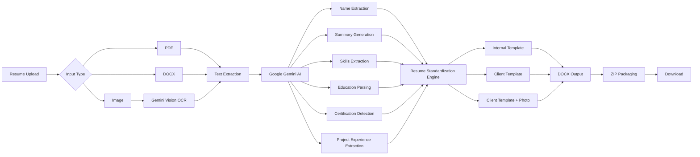
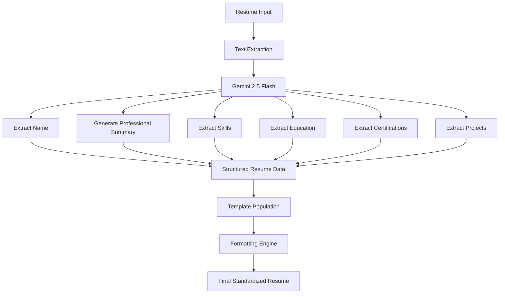
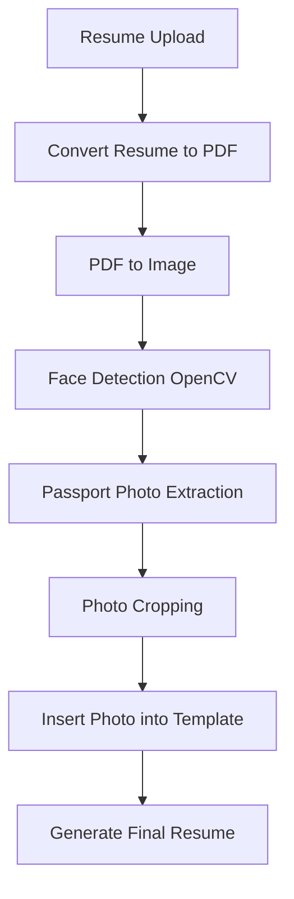
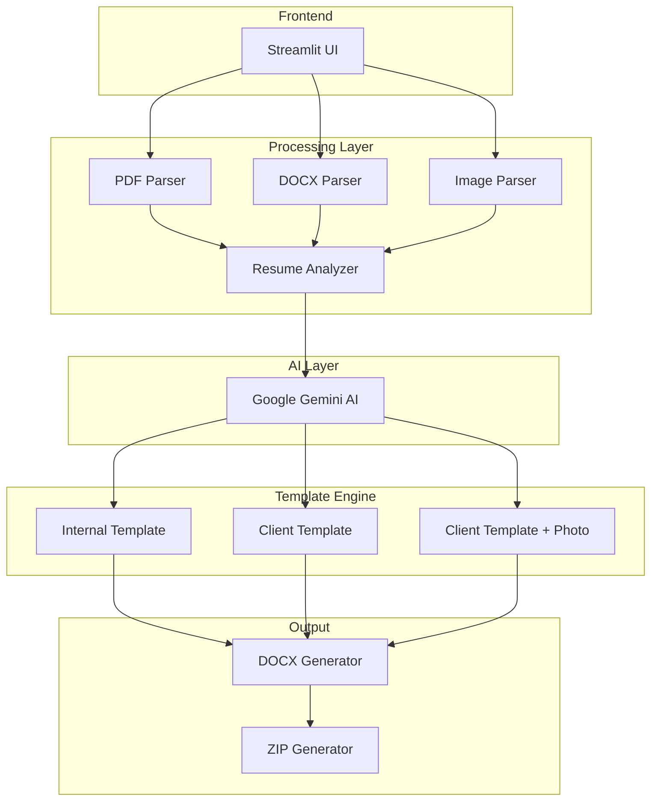

# 📄 Resume Standardization System

### AI-Powered Resume Transformation using Gemini AI

An intelligent resume standardization platform built with **Streamlit**, **Google Gemini AI**, **OpenCV**, and **Python-Docx** that automatically transforms resumes from multiple formats into standardized corporate templates.

Supports **PDF, DOCX, JPG, and PNG** resumes and generates professional recruiter-ready resume formats.

---

## 🚀 Features

✅ Multi-format Resume Upload (PDF, DOCX, JPG, PNG)

✅ AI-Powered Resume Understanding using Gemini

✅ Automatic Resume Standardization

✅ Education, Skills & Experience Extraction

✅ Project Experience Generation

✅ Passport Photo Extraction

✅ Bulk Resume Processing

✅ Multiple Corporate Templates

✅ ZIP Download Support

✅ Streamlit Web Interface

---

# 🏗️ System Architecture



---

# 🤖 AI Processing Pipeline



---

# 📷 Client Template With Photo Workflow

One of the unique features of this project is automatic passport-photo generation from resumes.



---

# 🧩 Component Architecture



---

# 📊 Technology Stack

| Category              | Technology              |
| --------------------- | ----------------------- |
| Frontend              | Streamlit               |
| LLM                   | Google Gemini 2.5 Flash |
| Vision AI             | Gemini Vision           |
| PDF Processing        | PyMuPDF                 |
| DOCX Processing       | python-docx             |
| Image Processing      | OpenCV                  |
| Face Detection        | Haar Cascade            |
| PDF Generation        | ReportLab               |
| Environment Variables | python-dotenv           |
| Packaging             | ZipFile                 |

---

# 📁 Project Structure

```text
Resume-Standardization-System/
│
├── app.py
├── all_functions.py
├── .env
│
├── Templates/
│   ├── Kasukabe_template.docx
│   ├── Client sample format.docx
│   └── Client sample format-2.docx
│
├── agilisium_resume_internal_template/
├── agilisium_resume_client_format/
├── agilisium_resume_client_format_2/
│
├── passport_photo.png
│
└── README.md
```

---

# ⚙️ Installation

### Clone Repository

```bash
git clone https://github.com/yourusername/resume-standardization-system.git

cd resume-standardization-system
```

### Create Virtual Environment

```bash
python -m venv venv
```

Linux/Mac

```bash
source venv/bin/activate
```

Windows

```bash
venv\Scripts\activate
```

### Install Dependencies

```bash
pip install -r requirements.txt
```

### Configure Environment Variables

Create a `.env` file

```env
GEMINI_API_KEY=YOUR_API_KEY
```

### Run Application

```bash
streamlit run app.py
```

---

# 🔄 Resume Processing Workflow

```text
Resume Upload
      │
      ▼
Format Detection
      │
      ▼
Text Extraction
      │
      ▼
Gemini AI Analysis
      │
      ▼
Information Categorization
      │
      ├── Name
      ├── Education
      ├── Skills
      ├── Certifications
      ├── Experience
      └── Projects
      │
      ▼
Template Population
      │
      ▼
Document Formatting
      │
      ▼
ZIP Generation
      │
      ▼
Download
```

---

# 🎯 Business Use Cases

### HR Teams

* Resume Standardization
* Candidate Profiling
* Skill Inventory Creation

### Recruitment Agencies

* Bulk Resume Processing
* Client Format Generation
* Faster Candidate Submission

### Staffing Companies

* Automated Resume Enhancement
* Professional Resume Presentation
* Template Compliance

---

# 📈 Future Enhancements

* ATS Score Calculation
* Resume Ranking System
* JD Matching Engine
* Resume Skill Gap Analysis
* Multi-Language Resume Support
* Resume-to-LinkedIn Converter
* AI Career Advisor
* Dashboard Analytics
* Cloud Deployment

---

# ⭐ Project Highlights

* AI-powered Resume Understanding
* Gemini Vision Integration
* Passport Photo Extraction
* Multiple Resume Templates
* Bulk Processing Support
* Corporate Recruitment Ready
* End-to-End Automation
* Modern Streamlit Interface

---

## 📸 Screenshots

Add application screenshots here:

```md


```

---

## 👨‍💻 Author

**Arnab Giri**

M.Sc. Computer Science | AI & Machine Learning Enthusiast

GitHub: `arnabgiri85-ai`

---

This version is much more professional and visually appealing for recruiters, GitHub visitors, internship applications, and project demonstrations.
****
